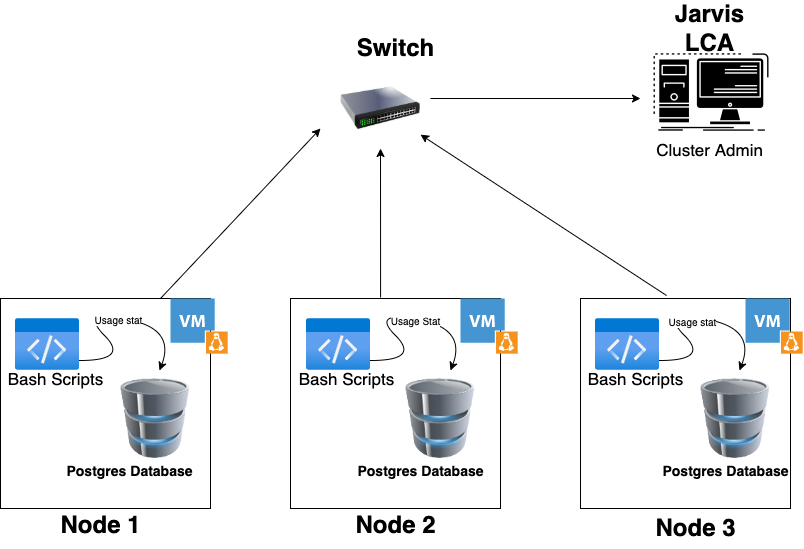

# LINUX CLUSTER MONITORING AGENT (LINUX,SQL AND DOCKER)
## Introduction
The monitoring agent does the job of actively keeping an eye on the usage statistics which helps in effective resource management.This is possible with help of several different technologies working in tandem. The monitoring agent works on each node inserting values every minute from the node into postgres SQL database which mounted on a container using Docker.

##### Technologies used for this project:-
1.VM instance running on Google Cloud Platform\
2.IntelliJ IDEA(To develop and edit script and SQL files)\
3.PostgreSQL v9.6.24-alpine(Database version)\
4.Jarvis Remote Desktop (JRD) for development/testing with CentOS 7\
5.Docker Engine Community v20.10.11(Container for running Postgres Database)\

# Quick Start
Commands for quick implementation of the project
- Start a psql instance using psql_docker.sh
  ```console
    psql_docker.sh create psql_username psql_password
  ```
- Create tables using ddl.sql
  ```console
    psql -h localhost -U postgres -d host_agent -f sql/ddl.sql
  ```
- Insert hardware specs data into the DB using host_info.sh
  ```console
   bash host_info.sh "psql_host" "psql_port" "db_name" "psql_user" "psql_password"
  ```
- Insert hardware usage data into the DB using host_usage.sh
  ```console
   bash host_usage.sh "psql_host" "psql_port" "db_name" "psql_user" "psql_password"
  ```
- Crontab setup
    ```console
    #edit crontab jobs
        bash> crontab -e
    #add this to crontab
        * * * * * bash /home/centos/dev/jrvs/bootcamp/linux_sql/host_agent/scripts/host_usage.sh localhost 5432 host_agent postgres password > /tmp/host_usage.log
    ```

# Implemenation
The project was implemented with three bash scripts, DDL and a few queries.The statistics was relayed on a timely basis to our postgres database using crontab.The detailed order and explanation of implementation is explained below

## Architecture


## Scripts
The bash scripts used in this project are as follows:
#### psql_docker.sh
The function of this Bash Script is to control our container. Additionally, if our container doesn't exist it helps to create one.
##### Usage
The command stated below inside our bash scripts helps to create one
```
psql_docker.sh create psql_username psql_password
```
This command below specifically helps to start our container and also returns the current status
```
psql_docker.sh start
```
Now to stop the active container use the code below
```
psql_docker.sh stop
```
#### host_info.sh
The function of this script is to supply hardware specifications to our database.This includes ***id, hostname, cpu number, cpu architecture, cpu model, cpu mhz, L2 cache, total memory, timestamp***
##### Usage
These parameters can be easily obtained using linux commands like lscpu, vmstat, grep ......

This script allows the data to be inserted into our database it supplies the essentials like ***port number , username, password, database name***
```
host_info.sh psql_host psql_port db_name psql_user psql_password
```

#### host_usage.sh
The function of this script is to supply usage statistics to our database. This includes ***timestamp, host id, memory free, cpu idle, cpu kernel, disk io, disk available***

##### Usage
These parameters can be easily obtained using linux commands like lscpu, vmstat, grep.....

This script allows the data to be inserted into our database it supplies the essentials like ***port number , username, password, database name***
```
host_usage.sh psql_host psql_port db_name psql_user psql_password
```

#### crontab
The sole purpose of using crontab is to feed data on a timely basis in our case its one minute.
##### Usage
```Shell
crontab -e
```
Store this script inside the task list of crontab jobs
```
* * * * * bash /home/centos/dev/jrvs/bootcamp/linux_sql/host_agent/scripts/host_usage.sh localhost 5432 host_agent postgres password > /tmp/host_usage.log
```

#### Queries
The SQL queries to extract certain pieces of data are stored in our queries.sql
- Query to group hosts by CPU number and sort by their memory size in descending order
- Query to find average used memory in percentage over 5 mins interval for each host
- Query to detect host failure

## Database Modeling
### host_info

The Table has a primary key id.Moreover, hostname has a unique constraint so that it stores and understands distinct nodes.

Column | Type | Description
--------------|------|--------------
Id | `SERIAL` | This field is of primary key with serial to assign values automatically.
hostname | `VARCHAR` | The name of the user server is stored in this field.
cpu_number | `INTEGER` | Hold the number of CPUs in the server.
cpu_architecture | `VARCHAR` | Information about CPU architecture
cpu_model | `VARCHAR` | Information about the CPU model.
cpu_mhz | `DECIMAL` | Contains the clock speed of the CPU.
L2_cache | `VARCHAR` | Holds the size of the L2 cache in the CPU.
total_mem | `VARCHAR` |Information about the total memory installed in the server.
Timestamp | `TIMESTAMP` | Hold the time at which the bash script inserts the data.

### host_usage

The usage statistics of our resources are stored in this table. The host id acts as a foreign key for the host usage table.

Column | Type | Description
--------------|------|--------------
Timestamp | `TIMESTAMP` | TimeStamp handles the insertion time of the data in UTI format.
host_id | `SERIAL` | Foreign key to the host info table.
memory_free | `VARCHAR` | Handles about the free memory.
cpu_idle | `INTEGER` | Percentage of the CPU idle time.
cpu_kernel | ` INTEGER ` | Information about the percentage of CPU usage.
disk_io | `INTEGER` | Holds the amount of disk I/O currently being used.
disk_available | `INTEGER` | Validates the disk available space in the CPU.


# Testing
The testing and debugging was implemented as follows:-
- Use inbuilt debugging and testing tool from Bash
  ```
  bash -x /script.sh
  ```
- Test if crontab is working by using
  ```
  SELECT * FROM host_uage;
  ```
# Deployment
- All scripts and SQL files are deployed onto GitHuB repository excluding local instance of postgres database which is mounted on Docker.
- Install Docker Engine, Postgres Image and deploy a database on your local repository
# Improvements
- Connect the Database to a visualization tool to represent data better
- More queries to understand the resources needed for each node
- Script to log failures and turn OFF logging usage when Node is not active 
