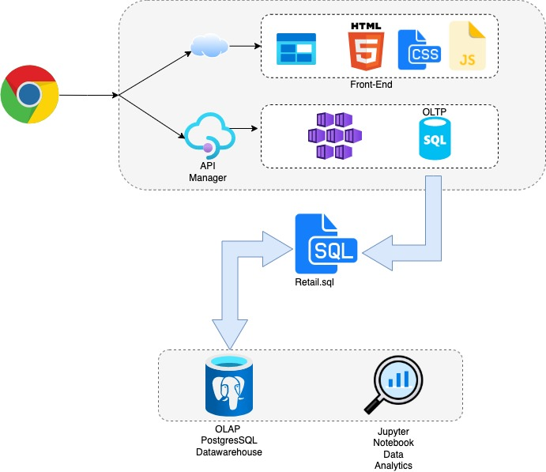

# Introduction
LGS(London Gift Shop) is a UK-based online store that has been selling gift-ware for over 10 years now. The purpose of this project was to deliver a PoC(Proof of Concept) to LGS marketing team. The analysis thus found can be used to make informed business decisions and will aid the marketing team in developing an efficient strategy for promoting their business.

The Data consulting team at Jarvis pipelined the batch processed data from OLTP to OLAP. This data was then mounted on PSQL database which was running on a Docker environment which acted as Data Warehouse.SQL queries were used to explore the data. Another container was setup for jupyter notebook. The notebook and the database connected via network created in Docker. Python was the language used in analysis.Different Python libraries such as Pandas, Matplotlib and NumPy was used for manipulation, visualization and numerical operations respectively. Finally, RFM(Receny,Frequency and Monetary) segmentation was used group customers based on different categories. This will help in determining optimal marketing strategies
# Implementaion
## Project Architecture

## Data Analytics and Wrangling
[Click to access (Jupyter Notebook)](./python_data_wrangling/retail_data_analytics_wrangling.ipynb)

- A Plot(Placement/Cancelled) in the analysis has expressed that cancelled orders has increased slightly compared to previous date/time points. This requires attention and the customers who cancelled the orders can be provided with a discounted offer so that they come back and make a purchase.
- The RFM segementation has potrayed that Loyal/Chanpion Customers are more like to respond to a marketing email or promotion.Providing them with more offers and promotions will yield better profit. However, Hibernating/about to sleep customers won't respond.There previous purchases needed to identified and more discount should be provided against the same product.

# Improvements
- Setup an interactive dashboard of RFM so that the marketing team can better understand the   data
- Since LGS is an online store we can track the customer purchase journey and understand what   worked and provide the same pasth to new users so they are likely to make a purchase.
- Find out a time of year where there sales are lower so they can provide more offers or    discounts
